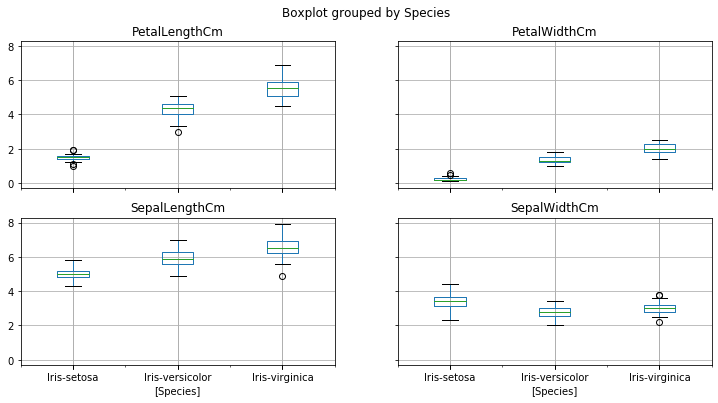
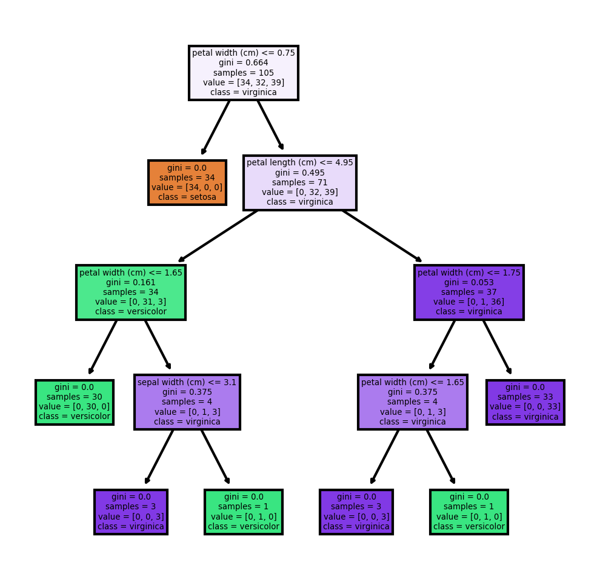

# Decision Tree

Decision tree is the most powerful and popular tool for classification and prediction. A Decision tree is a flowchart like tree structure, where each internal node denotes a test on an attribute, each branch represents an outcome of the test, and each leaf node (terminal node) holds a class label.Decision trees can handle high dimensional data. In general decision tree classifier has good accuracy. Decision tree induction is a typical inductive approach to learn knowledge on classification.
 
## Problem :
   
For the given ‘Iris’ dataset, create the Decision Tree classifier and visualize it graphically. The purpose is if we feed any new data to this classifier, it would be able to predict the right class accordingly.
   
## Dataset:
  
   Data can be found at :  https://drive.google.com/file/d/11Iq7YvbWZbt8VXjfm06brx66b10YiwK-/view
EDA : The dataset contains 150 rows and 6 columns the columns are SepalLenght,SepalWidth,PetalLenght,PetalWidth all the scales are in centemeter(cm) and the last row is Species which determine weather the flower is Setosa, Versicolor or Virginica.
The data distribution among setosa, virginica, versicolor are equal so iris dataset is a Balanced dataset (as the number of data points for every class is 50). 
Sepal length,Sepal width, Petal length, Petal width are called feature/Input-variable/Independent-variable Species are called Labels/Dependent-variable/Output-variable/class-label/Response label

## Import necessary libraries
  
 import numpy as np
 import pandas as pd
 import matplotlib.pyplot as plt
 import seaborn as sns
 
## Visual Exploratory Data
 
  
  
From the pairplot, we can see that the Iris-setosa species is separataed from the other two across all feature combination

  
## Preparing the data
 
 Independent variable or input variable = Feature variable = x
 Dependent variable or output variable = Target variable = y
 
## Split the datset

Split the data into training and test datasets, we'll do this by using Scikit-Learn's built-in train_test_split() method The model learn the relationships from the training data and predict on the test data.i have split the data in 70:30 ratio
 
## Traning the Algorithm

I have split the data into training and testing sets, and now i ll train the algorithm using DecisionTreeeClassifier method,then instaniate the Classifier and fit it on the traning set using the fit() method In this step the model learned the relationships between the training data ie,x_train and y_train.
 
 ## Accuracy is 97%
 
## Predict the data
 
Now the model is ready to make predictionson the test data using the predict() method
 
   Comparing actual vs predicted

    df = pd.DataFrame({'Actual': y_test, 'Predicted': y_pred})  
    df.head()
    
        	Actual	           Predicted
    Id		
    115	 Iris-virginica	  Iris-virginica
    63	  Iris-versicolor	 Iris-versicolor
    34	  Iris-setosa	     Iris-setosa
    108	 Iris-virginica	  Iris-virginica
    8	   Iris-setosa     	Iris-setosa
 
## Plot the Decision Tree

Plotting the tree obtained using sklearn tree module

  
## Conclusion
We made a model that predicts the species from the iris dataset using Decision tree calssifier where the accuracy was found to be 97% overall.And made a comparission between the actual and the predicted values which was found to be same in all the cases.And finally visualized the Decision tree classifier.
